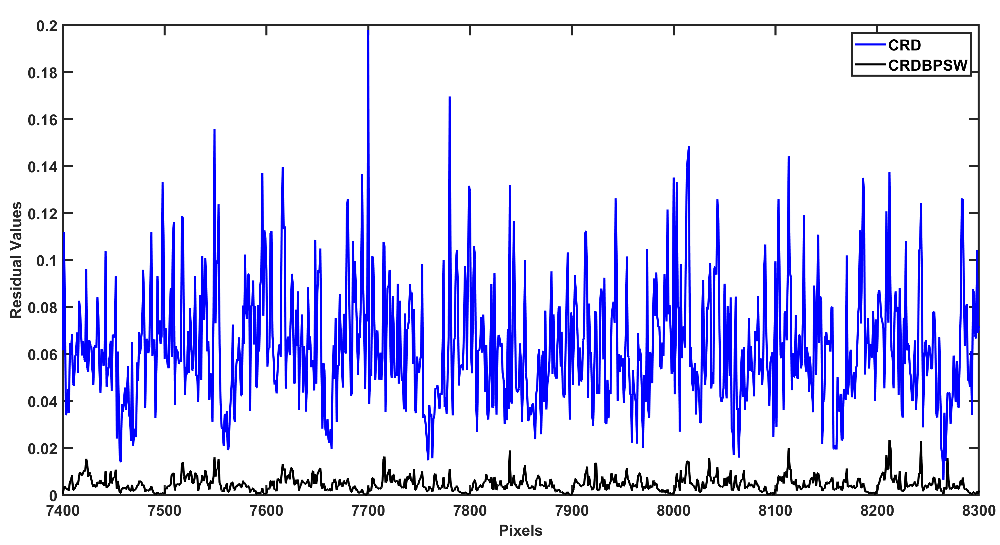

# Hyperspectral-Anomaly-Detection-CRDBPSW

**Paper: Collaborative representation with background purification and saliency weight for hyperspectral anomaly detection**


Fig.1. Schematic of the proposed background purification framework



Fig.2. Residual values of CRD and the proposed CRDBPSW using background pixels in the San Diego dataset


Fig.3. Comparison of spectral signatures using one chosen background pixel

# Prerequisites
**MATLAB R2018a**


# Source
**Paper Download:**<br />
- [IGARSS2020 Conference Paper](https://ieeexplore.ieee.org/document/9451632)
- [SCIENCE CHINA Information Sciences](https://www.sciengine.com/publisher/scp/journal/SCIS/doi/10.1007/s11432-020-2915-2?slug=abstract)


# Citation
The expanded paper has not yet been included in IEEE for the time being, while the IGARSS2020 conference paper and the preprint version of the expanded paper are available. If these codes and dataset are helpful for you, please cite this paper:

**BibTex Format:**<br />
```
@INPROCEEDINGS{9324521,
author={Hou, Zengfu and Li, Wei and Gao, Lianru and Zhang, Bing and Ma, Pengge and Sun, Junling},
booktitle={IGARSS 2020 - 2020 IEEE International Geoscience and Remote Sensing Symposium},
title={A Background Refinement Collaborative Representation Method with Saliency Weight for Hyperspectral Anomaly Detection},
year={2020},
volume={},
number={},
pages={2412-2415},
doi={10.1109/IGARSS39084.2020.9324521}}
```

**Plain Text Format:**<br />
```
Z. Hou, W. Li, L. Gao, B. Zhang, P. Ma and J. Sun, "A Background Refinement Collaborative Representation Method with Saliency Weight for Hyperspectral Anomaly Detection," IGARSS 2020 - 2020 IEEE International Geoscience and Remote Sensing Symposium, 2020, pp. 2412-2415, doi: 10.1109/IGARSS39084.2020.9324521.
```


# Other Related Papers
[1] Kun Tan, **Zengfu Hou**, Fuyu Wu,Qian Du, and Yu Chen. [Anomaly Detection for Hyperspectral Imagery Based on the Regularized Subspace Method and Collaborative Representation](https://www.mdpi.com/2072-4292/11/11/1318) [J]. Remote Sensing 2019, 11(11): 1318. [Co-first author]

[2] Kun Tan, **Zengfu Hou**, Dongelei Ma, Yu Chen, and Qian Du. [Anomaly detection in hyperspectral imagery based on low-rank representation incorporating a spatial constraint](https://www.mdpi.com/2072-4292/11/13/1578) [J]. Remote Sensing, 2019, 11(13): 1578. [Co-first author]

[3] Jun Liu, **Zengfu Hou**, Wei Li, Ran Tao, Danilo Orlando and Hongbin Li. [Multipixel Anomaly Detection With Unknown Patterns for Hyperspectral Imagery](https://ieeexplore.ieee.org/abstract/document/9404853) [J]. IEEE Transactions on Neural Networks and Learning Systems, doi: 10.1109/TNNLS.2021.3071026. [Second author]

[4] **Zengfu Hou**, Yu Chen, Kun Tan, and Peijun Du. [NOVEL HYPERSPECTRAL ANOMALY DETECTION METHODS BASED ON UNSUPERVISED NEAREST REGULARIZED SUBSPACE](https://pdfs.semanticscholar.org/43ba/4ca04679165d72e9f3fd3a9b1346437b81f9.pdf) [C]. International Archives of the Photogrammetry, Remote Sensing & Spatial Information Sciences, 2018, 42(3)

[5] **Zengfu Hou**, Kun Tan, Yu Chen, and Peijun Du. [AN IMPROVED UNSUPERVISED NEAREST REGULARIZED SUBSPACE METHOD FOR HYPERSPECTRAL ANOMALY DETECTION](https://drive.google.com/file/d/1g3KkwsN2Q8pk7aMZEKGRdfoGEEcOTTRp/view) [C]. International Conference on Advanced Remote Sensing, 2018.


# Website
- [Github Website](https://zephyrhours.github.io/)
- [Chinese CSDN](https://blog.csdn.net/NBDwo)
