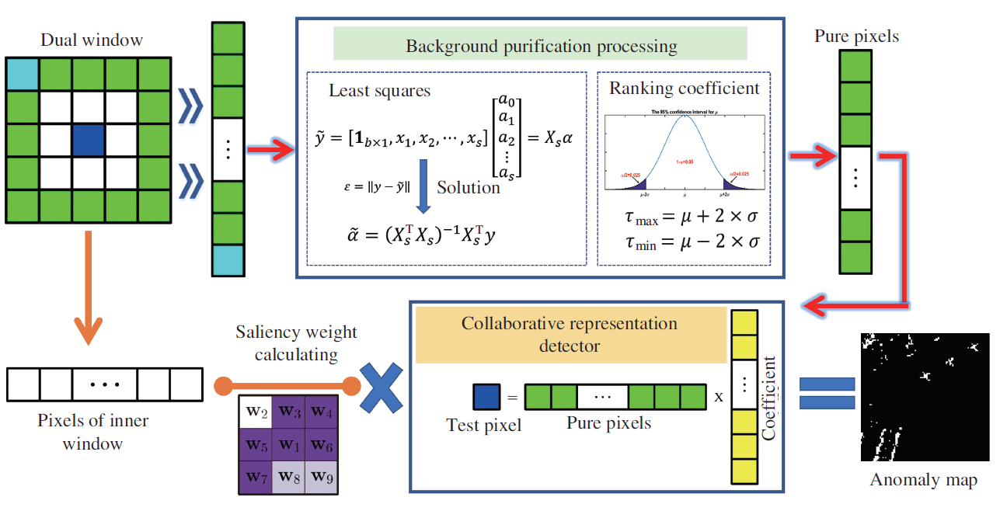

# Hyperspectral-Anomaly-Detection-CRDBPSW

**Paper: Collaborative representation with background purification and saliency weight for hyperspectral anomaly detection**

Fig.1. Schematic of the proposed background purification framework

# Source
**Paper Download:** 
- [IGARSS2020 Conference Paper](https://ieeexplore.ieee.org/document/9451632)
- [SCIENCE CHINA Information Sciences](https://www.sciengine.com/publisher/scp/journal/SCIS/doi/10.1007/s11432-020-2915-2?slug=abstract)

# Statement
The expanded article has not yet been published, this codes will be provided after the article is published.

# My Website
- [Github Website](https://zephyrhours.github.io/)
- [Chinese CSDN](https://blog.csdn.net/NBDwo)
