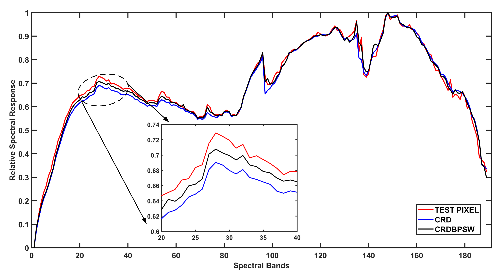

# Hyperspectral-Anomaly-Detection-CRDBPSW

**Paper: Collaborative representation with background purification and saliency weight for hyperspectral anomaly detection**


**Fig.1. Schematic of the proposed background purification framework**


**Fig.2. Residual values of CRD and the proposed CRDBPSW using background pixels in the San Diego dataset**


**Fig.3. Comparison of spectral signatures using one chosen background pixel**

# Prerequisites
**MATLAB R2018a**


# Source
**Paper Download:**<br />
- [IGARSS2020 Conference Paper](https://ieeexplore.ieee.org/document/9451632)
- [SCIENCE CHINA Information Sciences](https://www.sciengine.com/publisher/scp/journal/SCIS/doi/10.1007/s11432-020-2915-2?slug=abstract)


# Citation
The expanded paper has not yet been included in IEEE for the time being, while the IGARSS2020 conference paper and the preprint version of the expanded paper are available. If these codes and dataset are helpful for you, please cite this paper:

**BibTex Format:**<br />
```
@INPROCEEDINGS{9324521,
author={Hou, Zengfu and Li, Wei and Gao, Lianru and Zhang, Bing and Ma, Pengge and Sun, Junling},
booktitle={IGARSS 2020 - 2020 IEEE International Geoscience and Remote Sensing Symposium},
title={A Background Refinement Collaborative Representation Method with Saliency Weight for Hyperspectral Anomaly Detection},
year={2020},
volume={},
number={},
pages={2412-2415},
doi={10.1109/IGARSS39084.2020.9324521}}
```

**Plain Text Format:**<br />
```
Z. Hou, W. Li, L. Gao, B. Zhang, P. Ma and J. Sun, "A Background Refinement Collaborative Representation Method with Saliency Weight for Hyperspectral Anomaly Detection," IGARSS 2020 - 2020 IEEE International Geoscience and Remote Sensing Symposium, 2020, pp. 2412-2415, doi: 10.1109/IGARSS39084.2020.9324521.
```

# Website
- [Github Website](https://zephyrhours.github.io/)
- [Chinese CSDN](https://blog.csdn.net/NBDwo)
